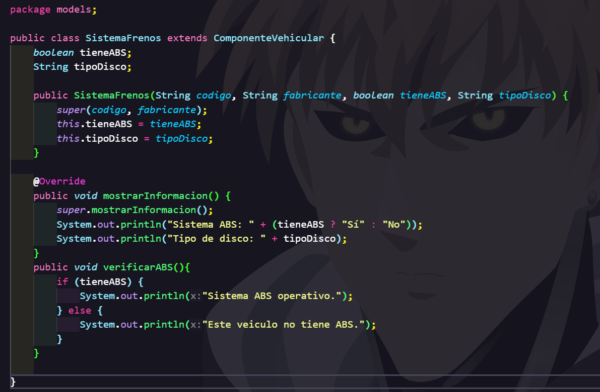
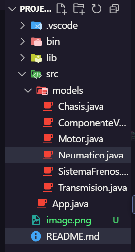

# Project Java Herencia

Este proyecto demuestra el concepto de **herencia** en Java mediante la implementación de varias clases y su estructura jerárquica.

## 📜 Jerarquía de clases

A continuación, se presenta la jerarquía de clases utilizada en el proyecto:

## 📂 Estructura del proyecto

## 🖥️ Salida por consola

